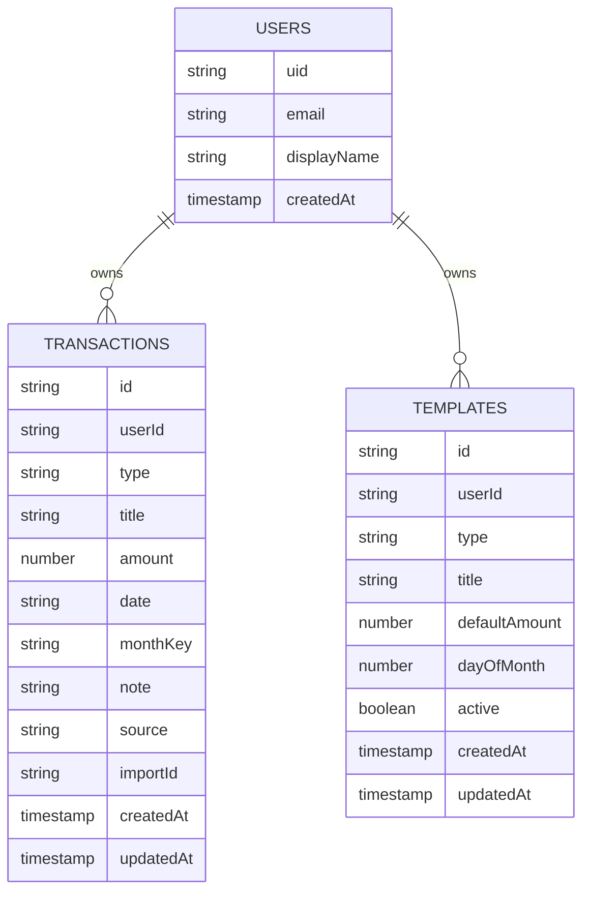
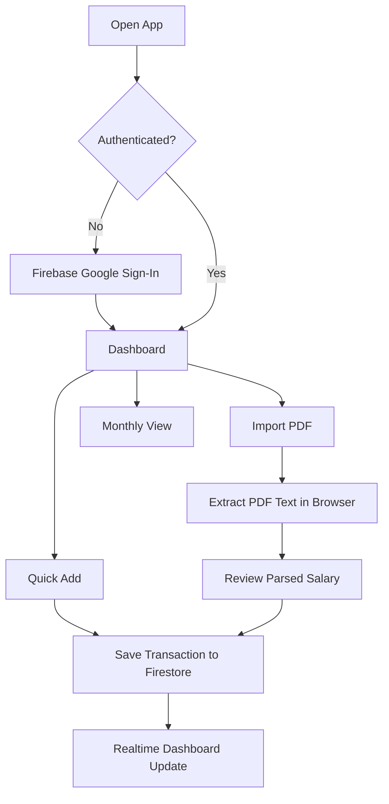
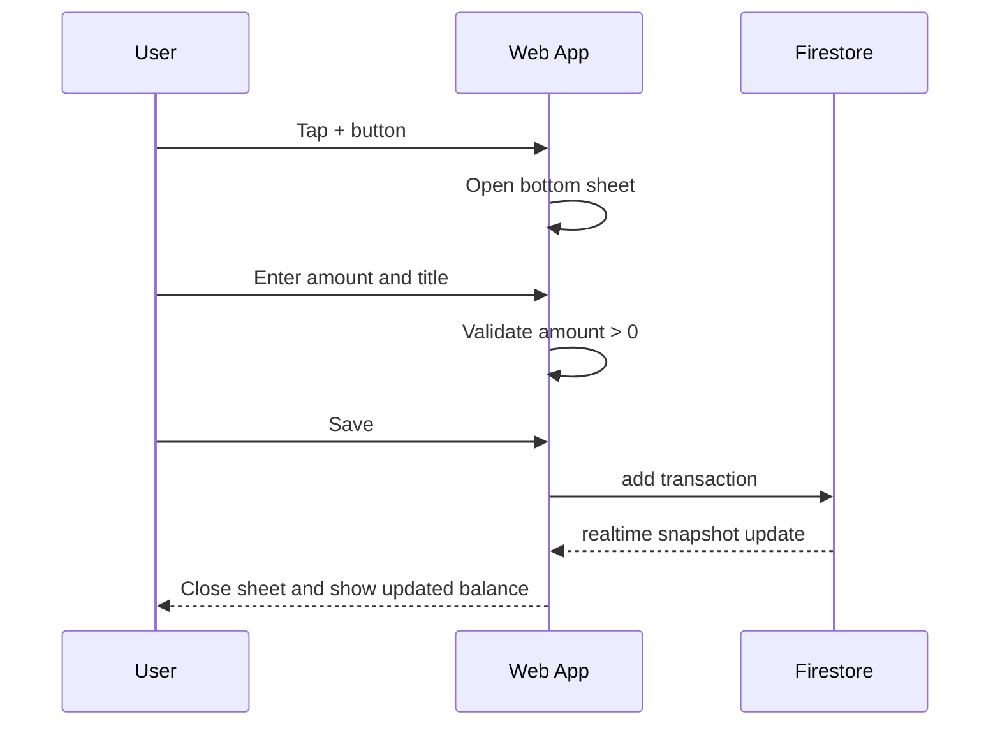
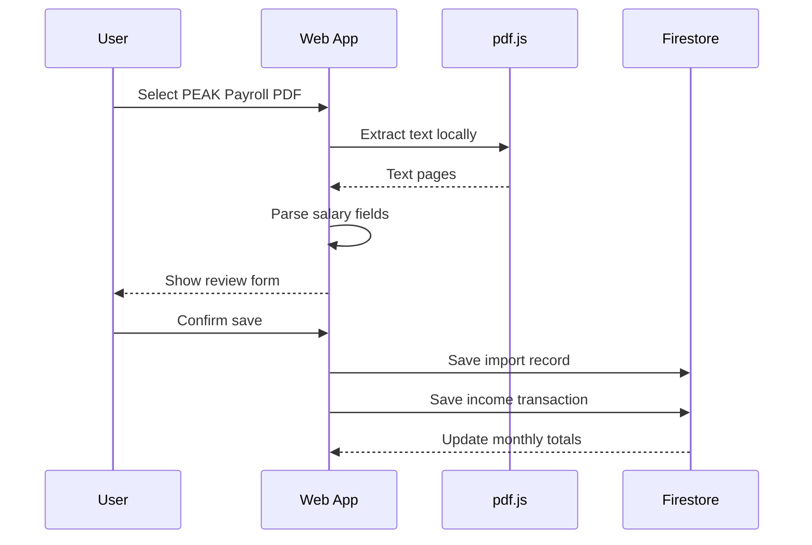
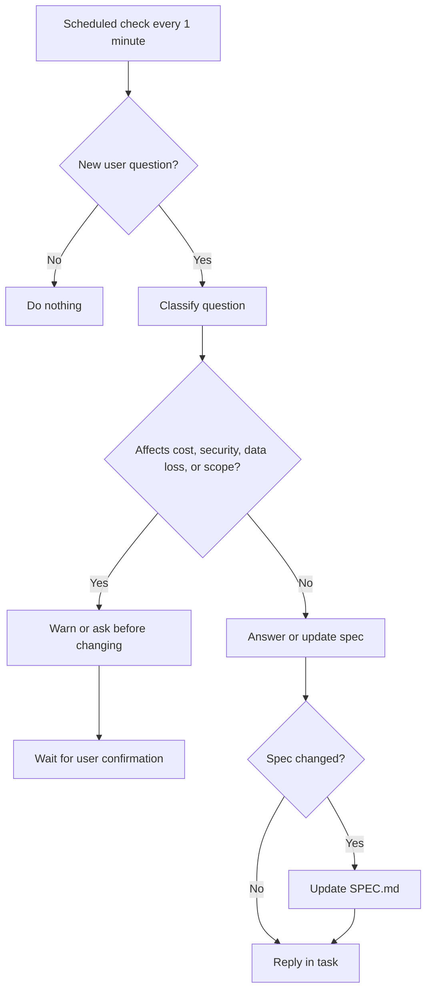

# Private Accounting System Spec

## Goal

ระบบรายรับรายจ่ายส่วนตัวที่บันทึกง่ายบนมือถือ ใช้ Tailwind และ Firebase เป็นหลัก โดยเริ่มจากฟีเจอร์ฟรี/ต้นทุนต่ำก่อน

โจทย์หลัก:

- บันทึกรายรับรายจ่ายให้เร็วกว่า Google Sheet เดิม
- ใช้งานบนมือถือเป็นหลัก
- ดูยอดคงเหลือรายเดือนได้ทันที
- มีปุ่มเบลอตัวเลขทั้งเว็บ
- Import เงินเดือนจาก PDF สลิป PEAK Payroll ได้
- ใช้ Firebase service ที่มี free tier ได้

## Non-Goals

- ยังไม่ทำระบบบัญชีหลายคนแบบองค์กร
- ยังไม่ทำ OCR สำหรับ PDF ที่เป็นรูป scan
- ยังไม่เก็บไฟล์ PDF ต้นฉบับบน Firebase Storage ใน MVP
- ยังไม่ทำ budget planner ซับซ้อน
- ยังไม่ทำ native mobile app

## Users

ผู้ใช้หลักคือเจ้าของบัญชีคนเดียว ต้องการจดรายการไว ๆ โดยไม่ต้องเปิดชีตและกรอกหลายช่อง

## Open Q&A

- Q: การกันรายการ recurring ซ้ำในเดือนเดียวกัน ควรอิงจากอะไร
  A: ตอนนี้ implement โดยอิง `templateId + monthKey` คือ template เดิมสร้างได้ไม่เกิน 1 ครั้งต่อเดือน
- Q: ส่วน "รายการล่าสุด" บน dashboard ต้องเป็นล่าสุดของเดือนที่เลือก หรือทั้งระบบ
  A: ตอนนี้ main list filter ตามเดือนที่เลือก และมี section ล่าสุดทั้งระบบแยกอีกก้อน
- Q: ถ้า parser PDF หา keyword ของ net salary ไม่เจอ ควร fallback แบบไหน
  A: ตอนนี้ fallback เป็นแสดง raw text sample และเดาค่าเริ่มต้นจากจำนวนเงินที่มากที่สุดในเอกสารก่อนให้ user review
- Q: ต้องการ format วันที่จาก PEAK Payroll แบบไหนเป็นหลัก
  A: ตอนนี้รองรับ `YYYY-MM-DD` และ `DD/MM/YYYY`

## Core UX Principles

1. Mobile first
2. รายจ่ายเป็น default เพราะใช้บ่อยกว่า
3. วันที่ default เป็นวันนี้
4. จำนวนเงินกรอกง่ายที่สุด
5. รายการซ้ำต้องกดจาก shortcut ได้
6. ทุกข้อมูลก่อนบันทึกจาก PDF ต้อง preview ก่อน
7. Privacy blur เป็นแค่การซ่อนบนจอ ไม่ใช่ security

## MVP Features

### 1. Auth

ใช้ Firebase Authentication

- Google Sign-In
- จำกัดข้อมูลตาม `uid`
- ถ้ายังไม่ login ให้แสดงหน้า login เท่านั้น

### 2. Dashboard

แสดงข้อมูลเดือนปัจจุบัน

- รายรับรวม
- รายจ่ายรวม
- คงเหลือ
- รายการล่าสุด
- ปุ่ม Quick Add
- ปุ่ม Privacy Blur
- ปุ่ม Import PDF

### 3. Quick Add

ฟอร์มบันทึกแบบเร็ว

Fields:

- type: `expense` หรือ `income`
- title
- amount
- date
- note optional

Defaults:

- type = `expense`
- date = วันนี้
- title = ว่าง
- amount = ว่าง

Shortcut chips:

- เงินเดือน
- ให้น้อง
- ผ่อนรถ
- โทรศัพท์
- เนตบ้าน
- บัตรเครดิต K+
- บัตรเครดิต UCHOOSE
- นาน

### 4. Transactions

รองรับ:

- เพิ่มรายการ
- แก้ไขรายการ
- ลบรายการ
- filter ตามเดือน
- เรียงตามวันที่ล่าสุดก่อน

### 5. Recurring Templates

ใช้สำหรับรายจ่าย/รายรับประจำ

Fields:

- title
- type
- defaultAmount
- dayOfMonth
- active

MVP behavior:

- กดสร้างรายการประจำของเดือนนี้
- ระบบสร้าง transaction จาก template ที่ active
- ถ้ารายการเดือนนั้นเคยถูกสร้างแล้ว ไม่สร้างซ้ำ

### 6. Monthly Summary

สรุปรายเดือน:

- incomeTotal
- expenseTotal
- balance
- transaction count

คำนวณจาก transaction ใน Firestore ฝั่ง client ก่อน เพื่อประหยัด Cloud Functions

### 7. Yearly Summary

มุมมอง 12 เดือน คล้ายชีต `รายจ่าย.html`

Columns:

- เดือน
- รายรับ
- รายจ่าย
- คงเหลือ

### 8. Privacy Blur

Toggle เดียวเพื่อเบลอตัวเลขทั้งเว็บ

Rules:

- blur เฉพาะ element ที่มี class/attribute สำหรับเงิน
- ไม่ blur label เช่น "รายรับ", "รายจ่าย"
- เก็บสถานะใน `localStorage`
- มีปุ่มบน header ทั้ง mobile และ desktop

ตัวอย่าง implementation:

```css
.privacy-blur [data-money] {
  filter: blur(6px);
  user-select: none;
}
```

### 9. PDF Import: PEAK Payroll

อ่าน PDF ฝั่ง browser ด้วย `pdfjs-dist`

Flow:

1. user เลือก PDF
2. browser extract text
3. parser หา field ที่เกี่ยวกับเงินเดือน
4. แสดงหน้า review
5. user กด save
6. สร้าง transaction type `income`

MVP extract targets:

- employee/pay period text ถ้ามี
- gross income ถ้าอ่านเจอ
- deductions ถ้าอ่านเจอ
- net salary
- payroll month/date

Fallback:

- ถ้าหา net salary ไม่เจอ ให้แสดง raw text บางส่วนและให้ user กรอกเอง
- ไม่ upload PDF ไป server

## Mobile Layout

### Mobile Dashboard

- Header sticky
- Summary 3 cards อยู่บนสุด
- Transaction list เป็น card list
- Quick Add เป็น bottom sheet
- Floating action button อยู่ขวาล่าง
- Import PDF อยู่ใน action menu หรือ header

### Desktop Layout

- Sidebar สำหรับเลือกเดือน/ปี
- Main table สำหรับ transactions
- Right panel สำหรับ summary และ shortcuts

## Data Model

ใช้ Cloud Firestore



### Collections

Recommended structure:

```text
users/{uid}
users/{uid}/transactions/{transactionId}
users/{uid}/templates/{templateId}
users/{uid}/imports/{importId}
```

### Transaction

```ts
type Transaction = {
  id: string;
  userId: string;
  type: "income" | "expense";
  title: string;
  amount: number;
  date: string; // YYYY-MM-DD
  monthKey: string; // YYYY-MM
  note?: string;
  source?: "manual" | "template" | "pdf";
  importId?: string;
  createdAt: Timestamp;
  updatedAt: Timestamp;
};
```

### Template

```ts
type Template = {
  id: string;
  userId: string;
  type: "income" | "expense";
  title: string;
  defaultAmount: number;
  dayOfMonth?: number;
  active: boolean;
  createdAt: Timestamp;
  updatedAt: Timestamp;
};
```

### Import Record

เก็บเฉพาะผล parse ไม่เก็บ PDF ต้นฉบับ

```ts
type ImportRecord = {
  id: string;
  userId: string;
  provider: "peak-payroll";
  fileName: string;
  status: "reviewed" | "saved" | "failed";
  extractedTextSample?: string;
  parsed: {
    title?: string;
    amount?: number;
    date?: string;
    grossIncome?: number;
    deductions?: number;
    netSalary?: number;
  };
  createdAt: Timestamp;
};
```

## System Flow



## Quick Add Flow



## PDF Import Flow



## Firebase Free-Tier Choices

Use:

- Firebase Authentication
- Cloud Firestore
- Firebase Hosting

Avoid in MVP:

- Cloud Functions
- Firebase Storage
- OCR APIs
- Scheduled jobs

Reason:

- Calculation can run client-side
- PDF parse can run client-side
- No server is needed for personal accounting MVP

## Firestore Queries

### Current Month Transactions

```ts
query(
  collection(db, "users", uid, "transactions"),
  where("monthKey", "==", currentMonthKey),
  orderBy("date", "desc")
)
```

### Year Summary

MVP:

- query all transactions where `date` is within selected year
- group by `monthKey` in client

Upgrade later:

- maintain monthly aggregate documents if reads become expensive

## Security Rules Draft

```js
rules_version = '2';

service cloud.firestore {
  match /databases/{database}/documents {
    match /users/{userId} {
      allow read, write: if request.auth != null && request.auth.uid == userId;

      match /{document=**} {
        allow read, write: if request.auth != null && request.auth.uid == userId;
      }
    }
  }
}
```

## Validation

Client-side validation:

- title required
- amount required
- amount must be positive
- type must be `income` or `expense`
- date must be valid `YYYY-MM-DD`

Firestore rules should enforce ownership. Deep schema validation can wait until needed.

## PDF Parser Rules

PEAK Payroll PDF parser should be defensive:

- normalize whitespace
- support comma numbers: `31,000.00`
- support Thai/English labels
- prefer net salary over gross salary
- if multiple candidate amounts exist, require review

Possible keywords:

- `เงินเดือน`
- `รายได้สุทธิ`
- `รับสุทธิ`
- `ยอดรับสุทธิ`
- `Net Pay`
- `Net Salary`
- `Total Income`
- `Deduction`

## Privacy & Security

- Do not upload PDF in MVP
- Do not store full extracted PDF text unless user confirms
- Store only parsed transaction/import result
- Firestore path must be scoped by user uid
- Blur mode is visual privacy only

## Suggested File Structure

```text
src/
  App.jsx
  main.jsx
  index.css
  firebase.js
  money.js
  pdfPayroll.js
```

Keep files small. Add folders only when the app grows.

## Implementation Phases

### Phase 1: App Shell

- Vite React
- Tailwind
- Firebase config via env
- Google login
- responsive dashboard shell
- privacy blur toggle

### Phase 2: Transactions

- quick add bottom sheet
- save/read Firestore transactions
- monthly totals
- edit/delete

### Phase 3: Templates

- recurring template CRUD
- generate current month items
- prevent duplicates

### Phase 4: PDF Import

- upload/select PDF
- local text extraction
- PEAK Payroll parser
- review before save

### Phase 5: Polish

- yearly summary
- empty states
- loading states
- basic offline behavior

## Acceptance Criteria

MVP is done when:

- User can login with Google
- User can add income/expense in under 10 seconds on mobile
- Dashboard updates without refresh
- User can filter by month
- Privacy blur hides all money values
- User can import a text-based PEAK Payroll PDF and review before saving
- No PDF file is uploaded to Firebase
- Firestore rules prevent reading another user's data

## Known Tradeoffs

- Client-side summaries are cheaper and simpler, but may read more documents later
- PDF parser may need adjustment after seeing real PEAK Payroll samples
- No OCR means scanned PDFs are unsupported in MVP
- No Cloud Functions means no server-side aggregate enforcement yet

## Q&A Ownership

ส่วนนี้เป็น responsibility ของ lead dev

Goal:

- ตรวจว่ามีคำถาม/ประเด็นค้างจาก user หรือไม่
- ถ้ามี ให้ตอบให้ชัด ตรง และตัดสินใจแทนในจุดที่ไม่ risky
- ถ้าคำถามกระทบ scope, security, cost, หรือ data loss ให้เตือนก่อน
- ถ้าคำถามเป็น implementation detail ให้ตอบตาม spec นี้เป็น source of truth
- ถ้าคำถามทำให้ spec ต้องเปลี่ยน ให้ update `SPEC.md`

Cadence:

- check ทุก 1 นาที
- ทำต่อเนื่องจนกว่า user จะสั่งหยุด
- ถ้าไม่มีคำถามใหม่ ไม่ต้อง spam response

Lead dev response rules:

- ตอบสั้นก่อน
- ถ้าต้องเลือก ให้เลือกทางฟรี/ใช้ Firebase ได้ก่อน
- ถ้าต้อง implement ให้เริ่มจาก shortest safe diff
- ถ้า requirement ยังคลุมเครือแต่มี default ที่ปลอดภัย ให้ตัดสินใจเอง
- ถ้า default เสี่ยง ให้ถามกลับ 1 คำถาม



## Open Q&A

### Q: ทำไม MVP ไม่ใช้ Cloud Functions?

A: ยังไม่จำเป็น ค่า summary คำนวณใน client ได้ และช่วยให้ใช้ฟรีง่ายกว่า

### Q: PDF สลิปเงินเดือนจะถูกอัปโหลดไหม?

A: ไม่อัปโหลดใน MVP อ่านด้วย `pdfjs-dist` ใน browser แล้วเก็บเฉพาะข้อมูลที่ user กดยืนยัน

### Q: Privacy blur ปลอดภัยไหม?

A: ไม่ใช่ security เป็นแค่ visual privacy กันคนมองจอ ข้อมูลจริงยังอยู่ใน browser และ Firestore

### Q: ถ้า PDF อ่านยอดผิดทำยังไง?

A: ต้องมีหน้า review ก่อน save เสมอ และ parser ต้อง fallback ให้ user กรอกเองถ้าไม่มั่นใจ

### Q: อะไรคือ feature แรกที่ควรทำ?

A: App shell + Google login + Dashboard + Quick Add + Privacy Blur ก่อน PDF import
